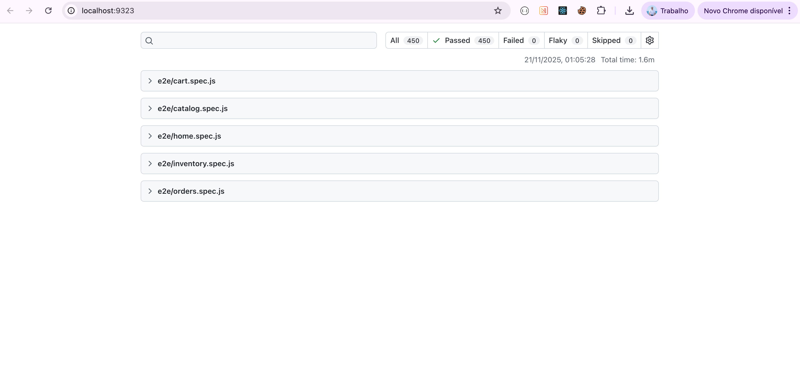
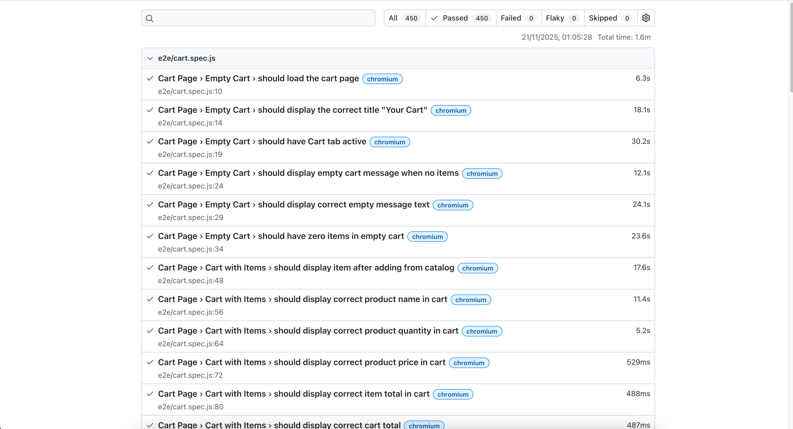
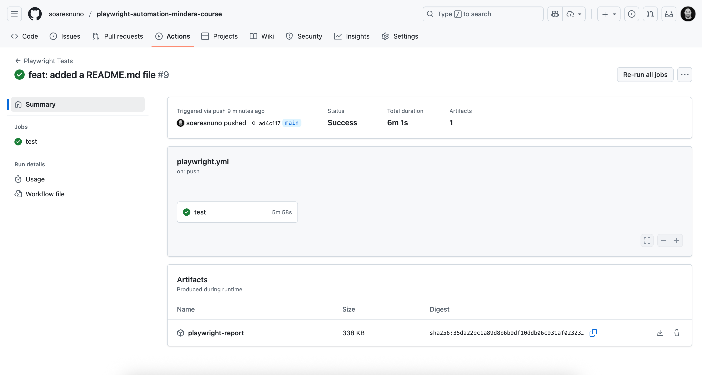
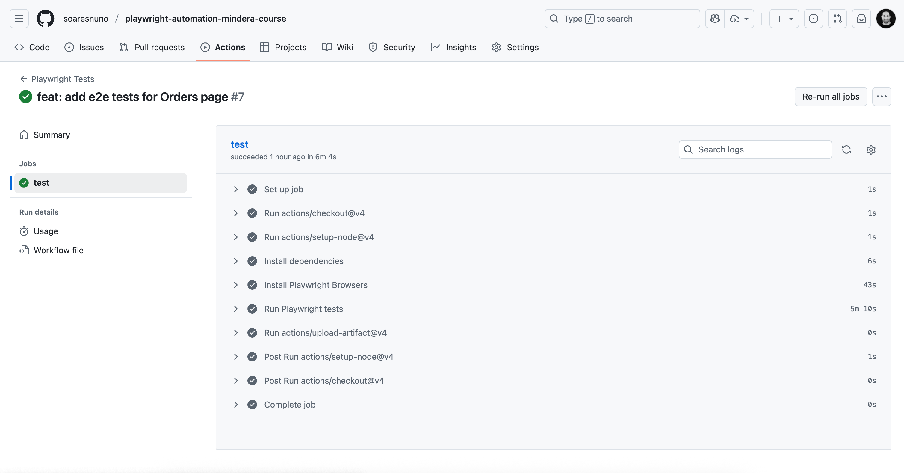
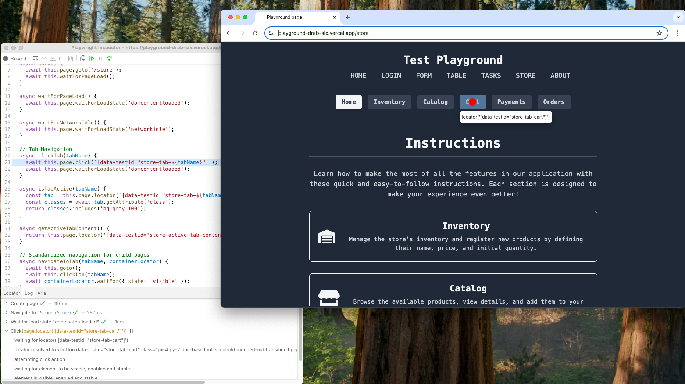
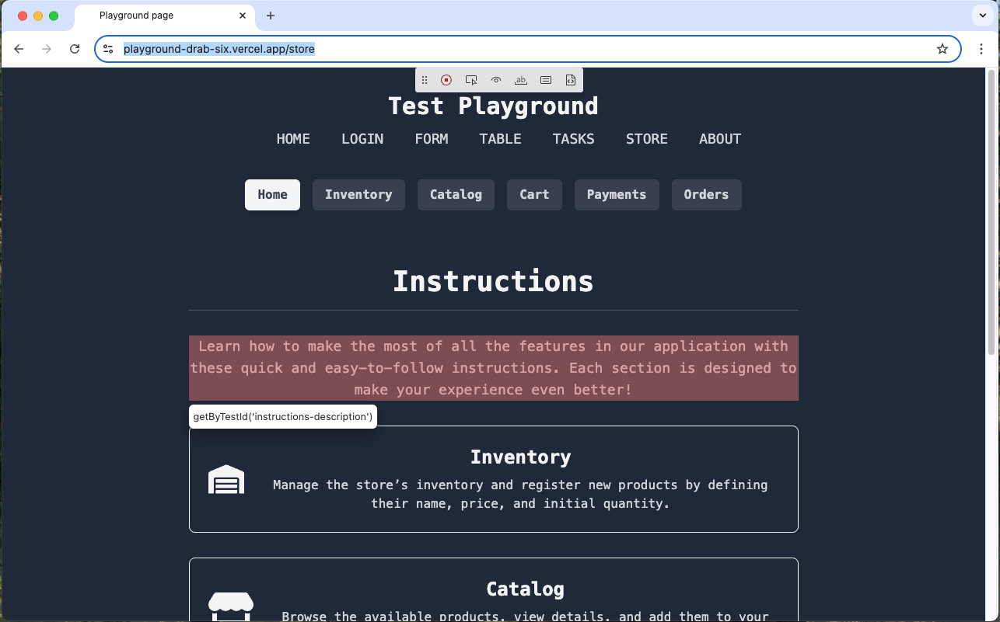

# Final Project E2E – Test Automation with Playwright

End-to-end test suite for the [Store application](https://playground-drab-six.vercel.app/store) using Playwright.
This project was developed as the final assignment for the **"Test Automation - WarmUp with Playwright"** course at **Mindera Code Academy**.

## Table of Contents

- [Documentation](#documentation)
- [Project Structure](#project-structure)
- [Prerequisites](#prerequisites)
- [Installation](#installation)
- [Available Scripts](#available-scripts)
- [Test Reports](#test-reports)
- [Configuration](#configuration)
- [Test Categories](#test-categories)
- [Writing New Tests](#writing-new-tests)
- [Additional Commands](#additional-commands)
- [CI/CD Integration](#cicd-integration)
- [Debug Mode and Headed](#debug-mode-and-headed)

## Documentation

Detailed documentation explaining the architectural choices is available in the `docs/` folder:

| Document | Description |
|----------|-------------|
| [01-architecture-overview.md](docs/01-architecture-overview.md) | Project structure and design principles |
| [02-page-object-model.md](docs/02-page-object-model.md) | POM pattern, BasePage, selector strategy |
| [03-fixtures.md](docs/03-fixtures.md) | Custom fixtures and dependency injection |
| [04-utility-methods.md](docs/04-utility-methods.md) | Utility methods and mock data strategy |
| [05-best-practices.md](docs/05-best-practices.md) | Testing guidelines and configuration |

## Project Structure

```
final_project_tests/
├── .github/                   # GitHub workflows and CI/CD
├── .gitignore
├── playwright.config.js       # Playwright configuration
├── package.json
├── README.md
├── docs/                      # Project documentation
│   ├── 01-architecture-overview.md
│   ├── 02-page-object-model.md
│   ├── 03-fixtures.md
│   ├── 04-utility-methods.md
│   └── 05-best-practices.md
├── images/                    # Screenshots for documentation
│   ├── debug.png
│   ├── headed.png
│   ├── pipeline.png
│   ├── pipeline1.png
│   ├── reports.png
│   └── reports1.png
└── tests/
    ├── e2e/                   # Test specifications
    │   ├── cart.spec.js       # Shopping cart tests
    │   ├── catalog.spec.js    # Product catalog tests
    │   ├── home.spec.js       # Home page tests
    │   ├── inventory.spec.js  # Inventory management tests
    │   └── orders.spec.js     # Orders page tests
    ├── fixtures/              # Test fixtures
    │   └── index.js           # Custom fixtures setup
    ├── mocks/                 # Mock data
    │   ├── catalog.js
    │   ├── index.js
    │   ├── inventory.js
    │   └── payments.js
    └── pages/                 # Page Object Models
        ├── BasePage.js        # Base page class
        ├── CartPage.js
        ├── CatalogPage.js
        ├── HomePage.js
        ├── InventoryPage.js
        ├── OrdersPage.js
        └── PaymentPage.js
```

## Prerequisites

- Node.js (v18 or higher)
- npm or yarn

## Installation

```bash
# Install dependencies
npm install

# Install Playwright browsers
npx playwright install
```

## Available Scripts

The project includes predefined npm scripts for common testing operations:

| Script | Command | Description |
|--------|---------|-------------|
| `npm test` | `playwright test` | Run all tests |
| `npm run test:ui` | `playwright test --ui` | Open interactive UI mode |
| `npm run test:headed` | `playwright test --headed` | Run tests with visible browser |
| `npm run test:debug` | `playwright test --debug` | Run tests in debug mode |
| `npm run test:list` | `playwright test --list` | List all tests without running |
| `npm run test:update` | `playwright test --update-snapshots` | Update visual snapshots |
| `npm run test:report` | `playwright show-report` | Open HTML test report |
| `npm run test:chromium` | `playwright test --project=chromium` | Run tests on Chromium only |
| `npm run test:firefox` | `playwright test --project=firefox` | Run tests on Firefox only |
| `npm run test:webkit` | `playwright test --project=webkit` | Run tests on WebKit only |
| `npm run codegen` | `playwright codegen <url>` | Generate test code interactively |
| `npm run browsers:install` | `playwright install --with-deps` | Install browsers with dependencies |

### Running Specific Test Files

```bash
npx playwright test tests/e2e/inventory.spec.js
```

## Test Reports

Reports are generated automatically after test runs with:
- Screenshots on failure
- Video recordings on failure
- Trace files on first retry

### View HTML report

```bash
npm run test:report
```

### Sample Reports

<p align="center">
  
</p>

<p align="center">
  
</p>

## Configuration

The test suite is configured in `playwright.config.js`:

- **Base URL**: `https://playground-drab-six.vercel.app/store`
- **Browsers**: Chromium, Firefox, WebKit
- **Parallel execution**: Enabled
- **CI retries**: 2 retries on CI, 0 locally

## Test Categories

| Test File | Description |
|-----------|-------------|
| `home.spec.js` | Home page navigation and layout |
| `inventory.spec.js` | Product inventory management, CRUD operations |
| `catalog.spec.js` | Product catalog browsing |
| `cart.spec.js` | Shopping cart functionality |
| `orders.spec.js` | Order history and management |

## Writing New Tests

Tests use the Page Object Model pattern:

```javascript
import { test, expect } from '../fixtures/index.js';

test.describe('Feature Name', () => {
  test('should do something', async ({ page, inventoryPage }) => {
    await inventoryPage.navigateToInventory();
    expect(await inventoryPage.isLoaded()).toBe(true);
  });
});
```

## Additional Commands

```bash
# Generate new test code with codegen
npm run codegen

# List all tests without running them
npm run test:list

# Run tests with verbose output
npx playwright test --reporter=list

# Update snapshots
npm run test:update
```

## CI/CD Integration

The test suite is configured for CI environments:
- Single worker on CI for stability
- 2 retries for flaky test handling
- Fails if `test.only` is left in code

```bash
# Run in CI mode
CI=true npx playwright test
```

<p align="center">
  
</p>

<p align="center">
  
</p>

## Debug Mode and Headed

<p align="center">
  
</p>

<p align="center">
  
</p>